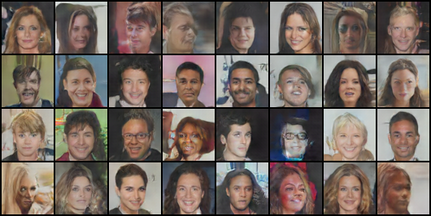
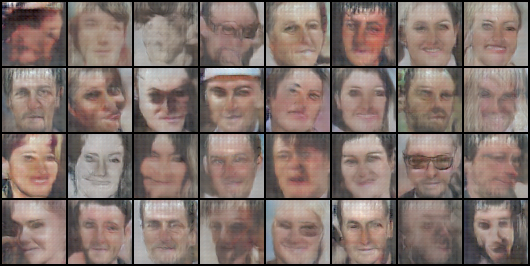
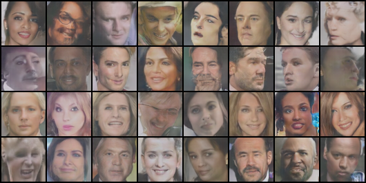

# Deep Convolutional Generative Adversarial Networks using pytorch
## Reference
- Paper: Unsupervised Representation Learning with Deep Convolutional Generative Adversarial Networks
    - [arxiv](https://arxiv.org/pdf/1511.06434.pdf)
- CelebA Dataset: [link](http://mmlab.ie.cuhk.edu.hk/projects/CelebA.html)
    - I use the img_align_celeba dataset.
- VGGFace2 Dataset: [link](http://www.robots.ox.ac.uk/~vgg/data/vgg_face2/)
    - I cut the face of the dataset into a square shape using the given bounding box.
    - I did not any normalization process. (So my dataset has a large variety)
    
## Requirements
- Python 3
- pytorch (I used version 0.4.)
- torchvision

## Usage
- python GAN.py --dataset_dir='dataset dir' --result_dir='result dir' \[--options...\]
    - example: python GAN.py --dataset_dir=./celeba --result_dir=./celeba_result
- options tips
    - Setting a high(2-4) n_cpu is very helpful for quick learning. (Learning with images takes a lot of time to read images from the drive)
    - Using MSE loss helps improve image quality. (see LS-GAN [arxiv](https://arxiv.org/pdf/1611.04076.pdf))    
- dataset example
    - ./celeba/celeba/000000.jpg
    - ./celeba/celeba/000001.jpg
    - ...
## Result
LS-GAN(use MSE loss) celeba 20 epoch result

DC-GAN(use BCE loss) VGGFace2 20 epoch result

LS-GAN VGGFace2 20 epoch result

